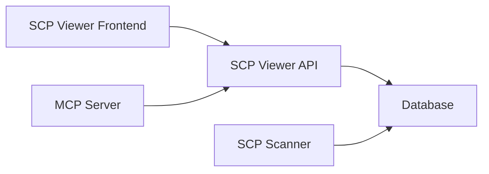

# SCP Viewer

Interactive web dashboard for visualizing and exploring SCP architecture graphs.

## Architecture



## Quick Start (Docker)

```bash
# Start all services
make up

# Run scanner to populate data
mkdir -p data
cp -r /path/to/repos/with/scp-yaml data/
make scan
# or
# V_DATA=<path_to_repos> make scan
```

**Viewer:** http://localhost:3000  
**API Docs:** http://localhost:4000/docs  
**Neo4j Browser:** http://localhost:7474

## Development

```bash
# Install dependencies
make setup

# Start just Neo4j
docker compose up -d neo4j

# Run API and Viewer locally
make dev
```

## Makefile Commands

Run `make help` to see all available commands.

## Packages

| Package | Description |
|---------|-------------|
| [viewer](./packages/viewer) | React + Cytoscape.js graph visualization |
| [api](./packages/api) | Express + OpenAPI REST API |
| [mcp](./packages/mcp) | MCP server for LLM access to SCP data |

## MCP Server

The MCP server exposes SCP architecture data to LLMs via the [Model Context Protocol](https://modelcontextprotocol.io).

### With Claude Desktop

Add to `~/.config/claude/claude_desktop_config.json`:

```json
{
  "mcpServers": {
    "scp": {
      "command": "node",
      "args": ["/path/to/scp-viewer/packages/mcp/src/index.js"],
      "env": {
        "SCP_API_URL": "http://localhost:4000"
      }
    }
  }
}
```

### Standalone

```bash
# Ensure API is running
make up

# Run MCP server
cd packages/mcp && SCP_API_URL=http://localhost:4000 npm start
```

### Available Tools

| Tool | Description |
|------|-------------|
| `list_systems` | List systems with tier/domain/team filters |
| `get_system` | Get system details by URN |
| `get_dependencies` | What a system depends on |
| `get_dependents` | What depends on a system |
| `blast_radius` | Calculate blast radius graph |
| `get_graph` | Get complete SCP graph |
| `get_teams` | List teams and owned systems |

### Available Resources

| URI | Description |
|-----|-------------|
| `scp://graph/summary` | System/edge counts, domains, teams |
| `scp://system/{urn}` | System details by URN |
